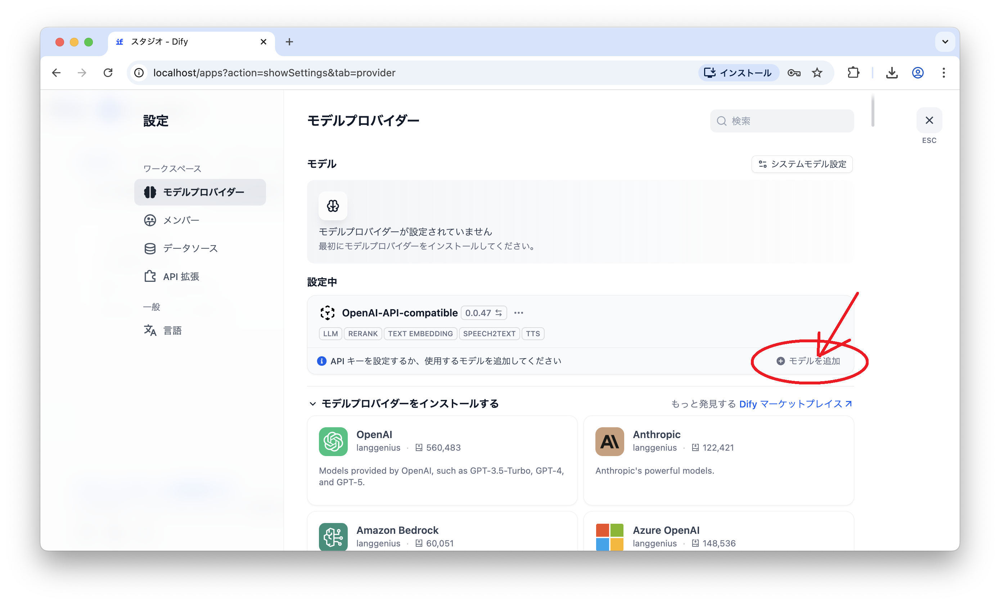
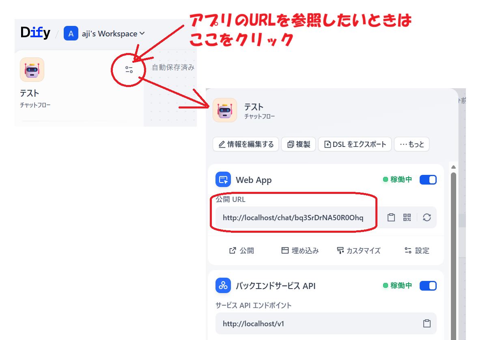
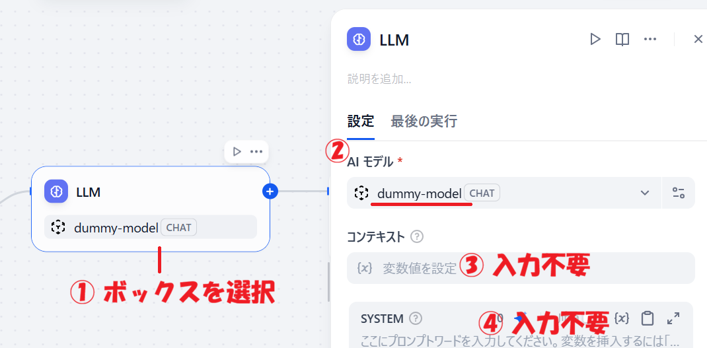

# Dify × ダミーLLM 技術検証サンプル

DifyのOpenAI互換プロバイダー機能を理解するために、**自作のダミーLLMサーバー**を使ってローカル環境でDifyと連携させる技術検証プロジェクトです。

## プロジェクト構成

```
.
├── README.md
└── dummy-llm/
    ├── server/
    │   ├── main.py              # FastAPI によるダミーLLMサーバー
    │   ├── requirements.txt
    │   └── Dockerfile
    ├── docker-compose.yml       # ダミーLLM単体の動作確認用
    └── dify-add/
        └── docker-compose.override.yml  # Dify の Compose に追加するオーバーライドファイル
```

## ダミーLLMサーバーの仕様

| エンドポイント | メソッド | 説明 |
|---|---|---|
| `/health` | GET | ヘルスチェック |
| `/v1/models` | GET | 利用可能モデル一覧 |
| `/v1/chat/completions` | POST | チャット補完（ストリーミング対応） |

- **通常レスポンス**: ユーザー入力を `なるほど、「{入力内容}」、そのとおりですね。` として返す
- **ストリーミング** (`stream: true`): 単語単位で分割してSSE形式で返す
- OpenAI API仕様に準拠したJSONレスポンス構造

---

## STEP 1: Difyと統合する

### 1-1. Dify公式リポジトリを取得

このリポジトリのルート（`README.md` と同じ階層）で作業することを想定しています。

動作確認済みの Dify タグ: `1.13.3`

```bash
# このリポジトリを配置したディレクトリへ移動
cd dify-mock

# Dify 公式リポジトリをクローン（このリポジトリ内に配置する）
git clone https://github.com/langgenius/dify.git

# 動作確認済みのタグをチェックアウト
cd dify-mock/dify
git checkout 1.13.3

# クローン後のディレクトリ構成
# dify-mock/
#   dummy-llm/     ← ダミーLLM
#   dify/          ← Dify 公式（クローン先）
```

### 1-2. オーバーライドファイルを配置する

Docker Compose の公式オーバーライド機能を使います。
`docker-compose.override.yml` を `dify/docker/` に置くだけで、`dummy-llm` サービスが自動的に追加されます。

```bash
# このリポジトリのルートから実行
cd dify-mock
cp dummy-llm/dify-add/docker-compose.override.yml dify/docker/
```

### 1-3. 起動

```bash
cd dify-mock/dify/docker
cp .env.example .env
docker compose up
```

Dify UIは `http://localhost` で起動します（初回はセットアップ画面が表示されます）。

---

## STEP 2: DifyのUIでダミーLLMを登録し、アプリから利用してみる

### 2-1. 管理者アカウントの設定

初回アクセス時はセットアップ画面が表示されます。

1. ブラウザで `http://localhost` を開く
2. **Email**・**Password** を入力して管理者アカウントを作成
3. ログイン後、ダッシュボードが表示されれば完了

### 2-2. プロバイダーの追加

1. Dify にログイン → 右上のアイコン → **Settings（設定）**
2. サイドバーの **Model Provider（モデルプロバイダー）** を選択
    ※このとき、一覧が表示されるのに少し時間がかかるかもしれません。
3. 一覧から **OpenAI-API-compatible** を探してクリック
4. **モデルを追加** ボタンを押下する
    ※ボタンを押した後、設定画面が表示されるまで少し時間がかかる場合があります。エラーが出ていなければそのまま待ってください。
    ※インストール済みのプロバイダーはモデルプロバイダー画面の上部に表示されます。

### 2-3. モデルの設定（ダミーLLM登録）

インストール済みの **OpenAI-API-compatible** が画面上部に表示されたら、**モデルを追加** ボタンを押下します。



以下の値を入力します：

| 項目 | 値 |
|---|---|
| **Model Name** | `dummy-model` |
| **Model Type** | `LLM` |
| **API Key** | `dummy-key`（任意の文字列でOK） |
| **API endpoint URL** | `http://dummy-llm:8000/v1` |

> ※必須項目のみ入力しています。オプション項目（Context window など）は入力していません。

> **API endpoint URLのポイント**
> - Dify と dummy-llm は同一Dockerネットワーク内にいるため、`localhost` ではなくコンテナ名 `dummy-llm` を使います
> - ポート番号 `8000` と `/v1` のパスを忘れずに

### 2-4. 接続テスト

設定画面の **追加** ボタンを押すと自動で接続確認が走ります。
成功するとモデルが一覧に追加されます。

### 2-5. アプリで使用する

モデルの設定画面が開いている場合は、**ESCキー** を押して閉じてからアプリの作成に進んでください。

1. **アプリを作成する** → **最初から作成** → **チャットフロー** を選択
2. アプリの名前を入力（「テスト」などでよい）して作成
3. 真ん中の **LLMブロック** に `dummy-model` が設定済みであればそのまま動作します
    - 設定されていない場合は下記「LLMブロックのモデル設定」を参照
4. **公開する** を押してアプリを公開する
5. **公開する** → **アプリを実行** を押すと新しいタブが開きます
    - そのタブのURLがアプリのURLです
    - 後からURLを確認する場合は、画面左側のアイコン横のボタンをクリックするとURLを参照できます

    
6. チャットでメッセージを送ると `なるほど、「{入力内容}」、そのとおりですね。` が返ってきます

#### LLMブロックのモデル設定

LLMブロックに `dummy-model` が設定されていない場合：

1. LLMブロックを選択
2. AIモデルとして `dummy-model` を選択
3. コンテキストや SYSTEM は未設定のままで OK



---

## Dify を完全に削除する

コンテナ・ボリューム・ディレクトリをすべて削除します。

```bash
# コンテナと名前付きボリュームを削除（-v を忘れると oradata・dify_es01_data が残る）
cd dify-mock/dify/docker
docker compose down -v

# Dify ディレクトリを削除（ローカルの DB・Redis データ等も含む）
cd ../..
rm -rf dify/
```

> **データは復元できません。** 削除前に必要なデータがないか確認してください。

---

## トラブルシューティング

### 接続エラー: `Connection refused`

Dify の `api` コンテナと `dummy-llm` コンテナが同じネットワークに属しているか確認します。

```bash
# コンテナのネットワーク確認
docker inspect dummy-llm | grep -A10 "Networks"
docker inspect docker-api-1 | grep -A10 "Networks"
```

### SSRFセキュリティブロック

DifyはデフォルトでSSRF対策が有効になっており、内部ネットワーク宛のリクエストをブロックする場合があります。
`ssrf_proxy_network` に `dummy-llm` を参加させることで回避できます（`dummy-llm/dify-add/docker-compose.override.yml` の `networks:` 設定を参照）。

### ストリーミングが途中で止まる

nginx のバッファリング設定が原因の場合があります。
ダミーLLMサーバーは `X-Accel-Buffering: no` ヘッダーを返しているため、
通常は問題ありませんが、Dify の nginx 設定を確認してください。

---

## 付録: ダミーLLMを単体で動作確認する

Dify と統合せずにダミーLLMサーバー単体の動作を確認したい場合はこちら。
**Dify と統合する場合はこの手順は不要です（実行するとコンテナが残り STEP 1 と干渉します）。**

```bash
# docker-compose.yml がある dummy-llm/ へ移動
cd dummy-llm

# ダミーLLMサーバーのみ起動
docker compose up --build

# 動作確認
curl http://localhost:8000/health
# => {"status":"ok"}

# 通常レスポンスのテスト
curl -X POST http://localhost:8000/v1/chat/completions \
  -H "Content-Type: application/json" \
  -d '{
    "model": "dummy-model",
    "messages": [{"role": "user", "content": "こんにちは"}],
    "stream": false
  }'

# ストリーミングのテスト
curl -X POST http://localhost:8000/v1/chat/completions \
  -H "Content-Type: application/json" \
  -d '{
    "model": "dummy-model",
    "messages": [{"role": "user", "content": "こんにちは"}],
    "stream": true
  }'

# 確認後はコンテナを停止・削除する
docker compose down
```

---

## 参考リンク

- [Dify 公式ドキュメント](https://docs.dify.ai)
- [Dify GitHub](https://github.com/langgenius/dify)
- [OpenAI API Reference - Chat Completions](https://platform.openai.com/docs/api-reference/chat)
